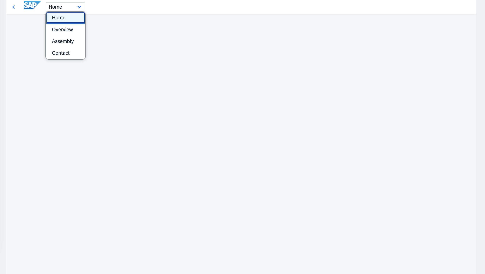
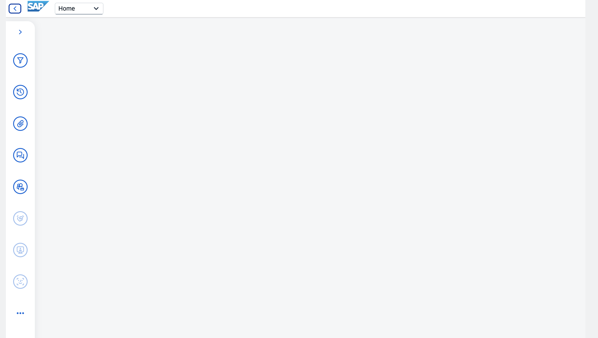
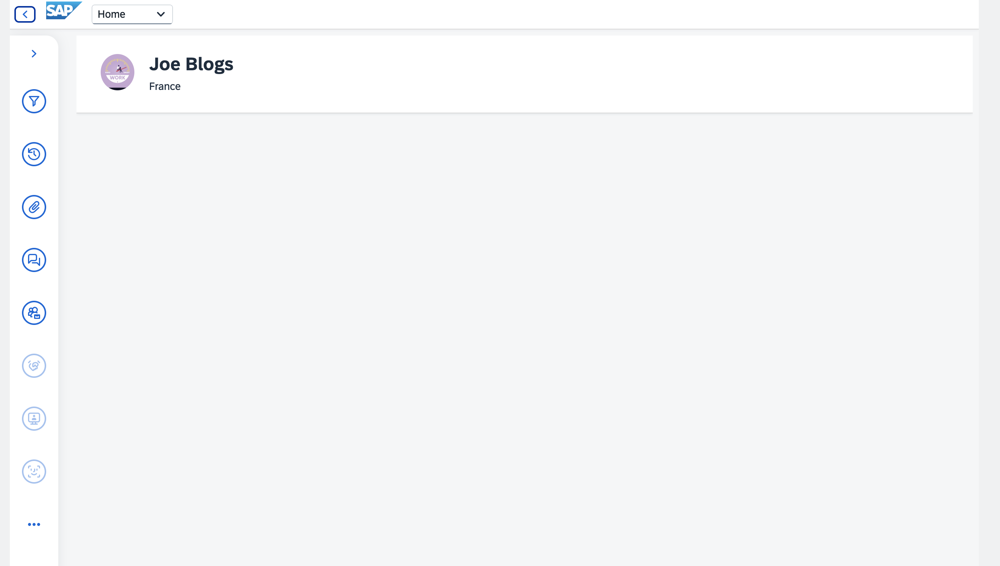
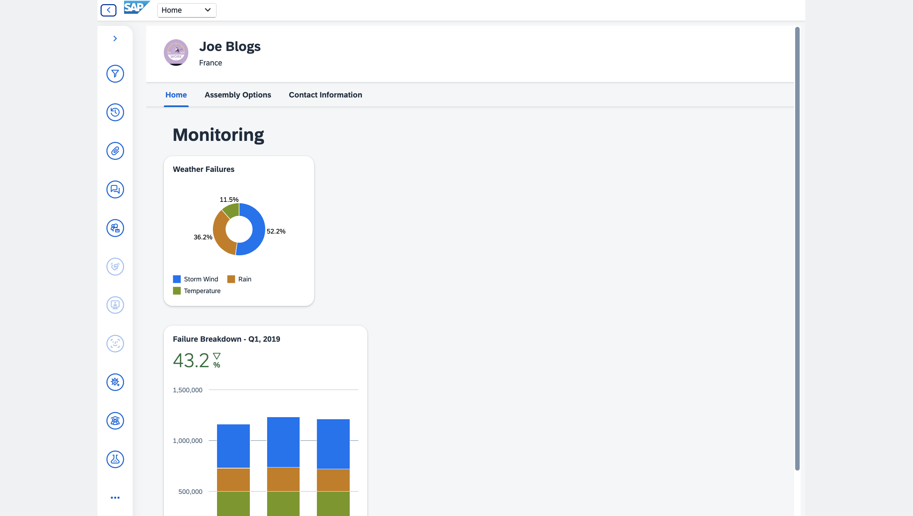
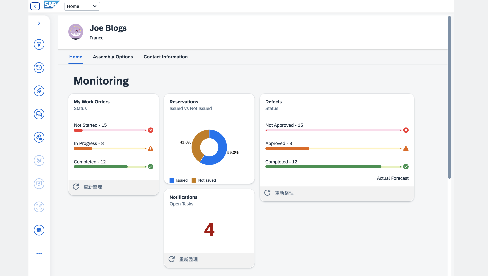
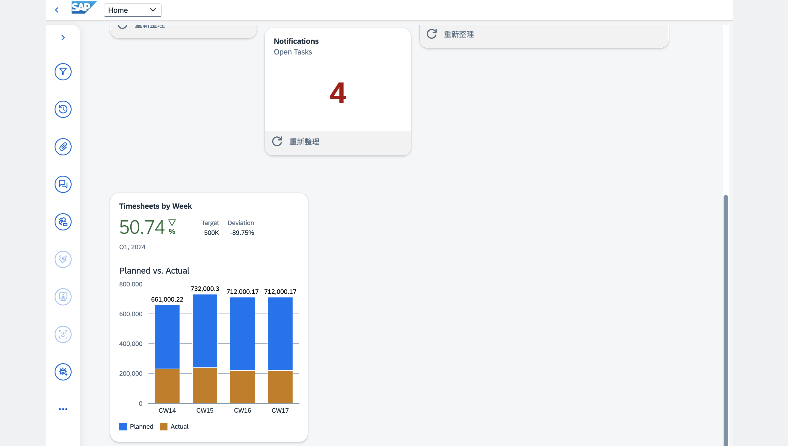
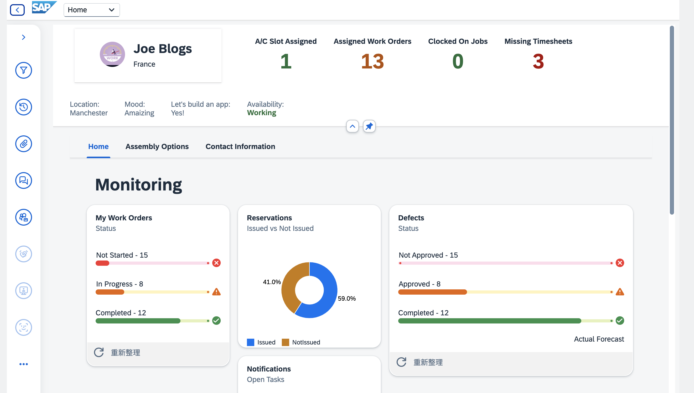

# SAPUI5 Dashboard Project

## Information

The prototype of UI5 dashboard v1 has been released. It is available to run the app by opening `index.html` in [dist](./dist/) folder.

## Progress

### 1. 5th January 2024, 08:00



### 2. 6th January 2024, 01:40



### 3. 6th January 2024, 10:30



### 4. 6th January 2024, 12:20



### 5. 7th January 2024, 02:02




### 6. 7th January 2024, 23:52



<br>

## Run the program

Download the repo and open a terminal to run the following command lines sequentially.

```Console
npm i -D @ui5/cli
```

```Console
npm init
```

```Console
ui5 init
```

```Console
npm start
```
